### hey, I'm Jeremy ∞

CS + Econ @ UW–Madison '28. I build quant systems and frontends with too much motion.

- **[thesis](https://thesis.jeremyxiang.com)** — congressional trading intelligence, decoded into a terminal
- **[the layering lab](https://lab.jeremyxiang.com)** — a fragrance-pairing engine, 439 bottles deep
- **[ascii-animator](https://github.com/Jeremy-Xiang/ascii-animator)** — the thing drawing that ∞ up there
- **[jeremyxiang.com](https://jeremyxiang.com)** — the night sky I live under

the animation above is an SVG generated by ascii-animator — GitHub READMEs can't run JS, but they will happily play CSS keyframes inside an image.
